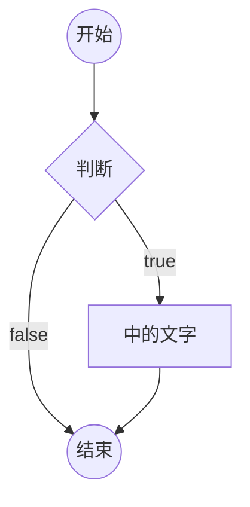
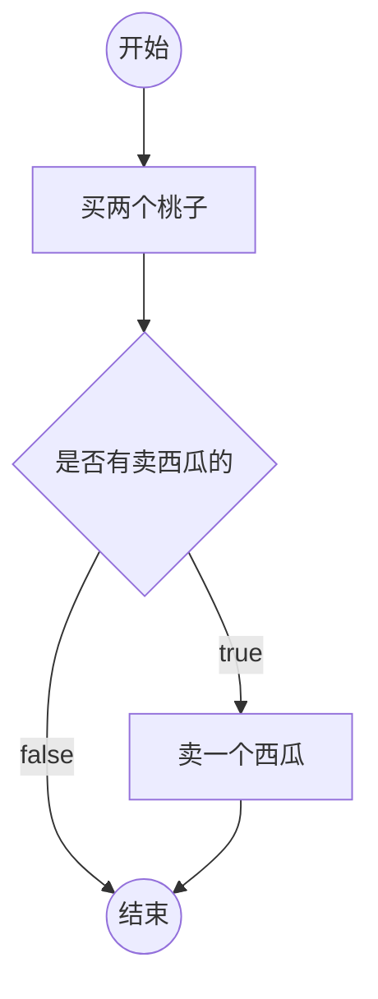
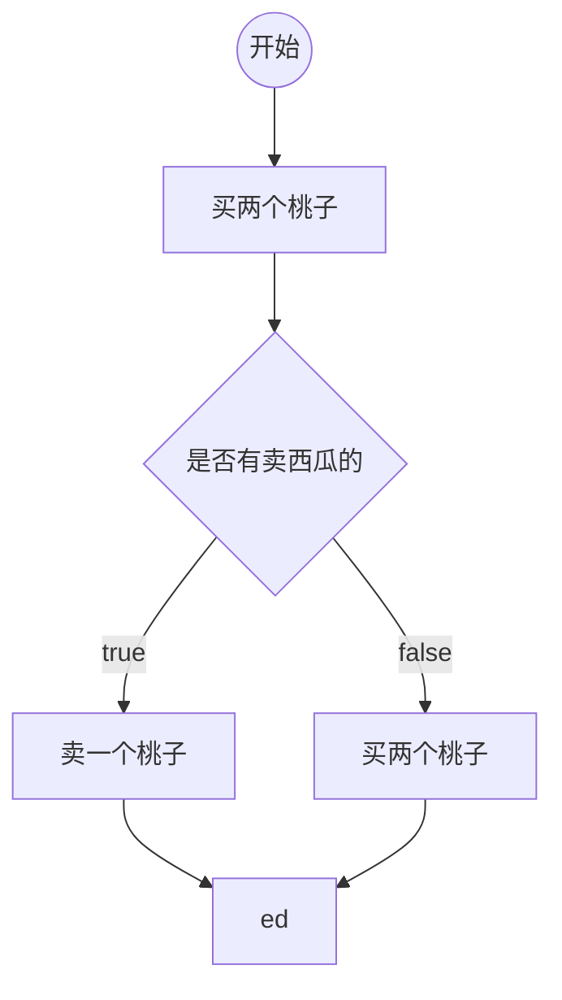

# 流程图

一套标准的图形,用于描述程序的逻辑  

通常用流程图分析程序的流程

## 在 markdown 中画流程图

```mermaid
graph TD
start((开始))-->if{判断}
if--true-->A[中的文字]
if--false-->ed((结束))
A-->ed
```

## 例子

```mermaid
graph TD
start((开始))-->buypeach[买两个桃子]
buypeach-->if{是否有卖西瓜的}
if--true-->buy[卖一个西瓜]
if--false-->ed((结束))
buy-->ed
```

```mermaid
graph TD
start((开始))-->buypeach[买两个桃子]
buypeach-->if{是否有卖西瓜的}
if--true-->buy1[卖一个桃子]
if--false-->buy2[买两个桃子]
buy1-->ed
buy2-->ed
```